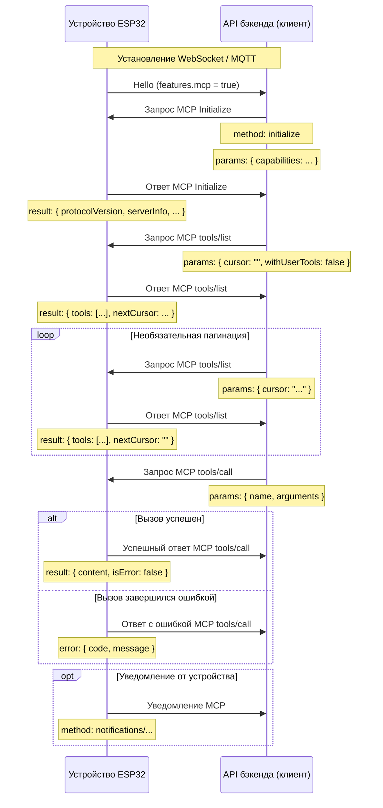

# Поток взаимодействия по протоколу MCP (Model Context Protocol)

ПРИМЕЧАНИЕ: этот документ подготовлен с помощью ИИ; при реализации бэкенда всегда сверяйте детали с кодом.

В этом проекте MCP используется между API бэкенда (клиент MCP) и устройством ESP32 (сервер MCP), чтобы позволить бэкенду обнаруживать и вызывать возможности устройства (инструменты).

## Формат сообщений

Согласно `main/protocols/protocol.cc` и `main/mcp_server.cc`, сообщения MCP инкапсулируются внутри транспортного слоя (WebSocket или MQTT). Внутренняя полезная нагрузка следует спецификации [JSON-RPC 2.0](https://www.jsonrpc.org/specification).

Общая компоновка сообщения:

```json
{
  "session_id": "...",   // идентификатор сессии
  "type": "mcp",         // фиксированное значение "mcp"
  "payload": {           // полезная нагрузка JSON-RPC 2.0
    "jsonrpc": "2.0",
    "method": "...",     // имя метода ("initialize", "tools/list", "tools/call", ...)
    "params": { ... },   // аргументы (для запросов)
    "id": ...,           // идентификатор запроса (для запросов и ответов)
    "result": { ... },   // успешный результат (ответ)
    "error": { ... }     // ошибка (ответ)
  }
}
```

`payload` следует стандарту JSON-RPC 2.0:

- `jsonrpc`: всегда `"2.0"`.
- `method`: имя метода (запросы).
- `params`: структурированные параметры, обычно объект (запросы).
- `id`: идентификатор запроса; возвращается в ответах.
- `result`: значение успеха (ответы).
- `error`: информация об ошибке (ответы).

## Поток взаимодействия

Взаимодействием по MCP управляет клиент (бэкенд), обнаруживая инструменты на устройстве и вызывая их.

1. **Подключение и объявление возможностей**

   - **Когда**: после загрузки устройства и подключения к бэкенду.
   - **Направление**: устройство -> бэкенд.
   - **Сообщение**: устройство отправляет hello транспорта, объявляя поддерживаемые возможности. Поддержка MCP сигнализируется значением `"mcp": true` в карте `features`.
   - **Пример (hello транспорта, не полезная нагрузка MCP):**
     ```json
     {
       "type": "hello",
       "version": 1,
       "features": {
         "mcp": true
       },
       "transport": "websocket",
       "audio_params": { ... },
       "session_id": "..."
     }
     ```

2. **Инициализация сессии MCP**

   - **Когда**: после того как бэкенд увидел, что устройство поддерживает MCP. Обычно это первый MCP-запрос.
   - **Направление**: бэкенд -> устройство.
   - **Метод**: `initialize`
   - **Сообщение (полезная нагрузка MCP):**
     ```json
     {
       "jsonrpc": "2.0",
       "method": "initialize",
       "params": {
         "capabilities": {
           // необязательные возможности клиента
           "vision": {
             "url": "...",   // конечная точка загрузки изображений с камеры (должен быть http URL, а не websocket URL)
             "token": "..."  // токен для URL загрузки
           }
           // ... другие возможности клиента
         }
       },
       "id": 1
     }
     ```

   - **Ответ устройства:**
     ```json
     {
       "jsonrpc": "2.0",
       "id": 1,
       "result": {
         "protocolVersion": "2024-11-05",
         "capabilities": {
           "tools": {}
         },
         "serverInfo": {
           "name": "...",    // имя устройства (BOARD_NAME)
           "version": "..."  // версия прошивки
         }
       }
     }
     ```

3. **Обнаружение инструментов**

   - **Когда**: всякий раз, когда бэкенду нужен список вызываемых инструментов и их сигнатур.
   - **Направление**: бэкенд -> устройство.
   - **Метод**: `tools/list`
   - **Параметры запроса**:
     - `cursor` (строка, необязательно): курсор пагинации. Пустой при первом запросе.
     - `withUserTools` (логическое, необязательно, по умолчанию `false`): если `true`, устройство дополнительно включает в перечень «инструменты только для пользователя» (см. раздел «Инструменты только для пользователя» ниже). Обычно используется сопутствующим приложением, позволяющим пользователю напрямую запускать привилегированные действия.
   - **Сообщение (полезная нагрузка MCP):**
     ```json
     {
       "jsonrpc": "2.0",
       "method": "tools/list",
       "params": {
         "cursor": "",
         "withUserTools": false
       },
       "id": 2
     }
     ```
   - **Ответ устройства:**
     ```json
     {
       "jsonrpc": "2.0",
       "id": 2,
       "result": {
         "tools": [
           {
             "name": "self.get_device_status",
             "description": "...",
             "inputSchema": { ... }
           },
           {
             "name": "self.audio_speaker.set_volume",
             "description": "...",
             "inputSchema": { ... }
           }
           // ... ещё инструменты
         ],
         "nextCursor": "..."
       }
     }
     ```
   - **Пагинация**: когда `nextCursor` непустой, бэкенд должен отправить ещё один запрос `tools/list` с этим курсором, чтобы получить следующую страницу.

4. **Вызов инструмента**

   - **Когда**: бэкенд хочет выполнить определённую функцию устройства.
   - **Направление**: бэкенд -> устройство.
   - **Метод**: `tools/call`
   - **Сообщение (полезная нагрузка MCP):**
     ```json
     {
       "jsonrpc": "2.0",
       "method": "tools/call",
       "params": {
         "name": "self.audio_speaker.set_volume",
         "arguments": {
           "volume": 50
         }
       },
       "id": 3
     }
     ```
   - **Успешный ответ:**
     ```json
     {
       "jsonrpc": "2.0",
       "id": 3,
       "result": {
         "content": [
           { "type": "text", "text": "true" }
         ],
         "isError": false
       }
     }
     ```
   - **Ответ с ошибкой:**
     ```json
     {
       "jsonrpc": "2.0",
       "id": 3,
       "error": {
         "code": -32601,
         "message": "Unknown tool: self.non_existent_tool"
       }
     }
     ```

5. **Уведомления по инициативе устройства**

   - **Когда**: устройство хочет сообщить бэкенду о внутренних событиях (например, переходах состояний). Исходящая точка входа — `Application::SendMcpMessage`.
   - **Направление**: устройство -> бэкенд.
   - **Метод**: по соглашению `notifications/...` или любой пользовательский метод.
   - **Сообщение (полезная нагрузка MCP)**: уведомления JSON-RPC не имеют `id`.
     ```json
     {
       "jsonrpc": "2.0",
       "method": "notifications/state_changed",
       "params": {
         "newState": "idle",
         "oldState": "connecting"
       }
     }
     ```
   - **Обработка на бэкенде**: обработать уведомление без ответа.

## Инструменты только для пользователя

Сервер MCP на устройстве поддерживает два вида инструментов:

- **Обычные инструменты** — регистрируются через `McpServer::AddTool`. По умолчанию публикуются бэкенду (а значит, и ИИ-модели).
- **Инструменты только для пользователя** — регистрируются через `McpServer::AddUserOnlyTool`. Они скрыты из стандартных результатов `tools/list`, поскольку представляют собой привилегированные или ориентированные на пользователя действия, которые ИИ не должен вызывать самостоятельно. Примеры: перезагрузка системы, обновление прошивки и загрузка снимка экрана.

Бэкенд подключает инструменты только для пользователя, отправляя `tools/list` с `params.withUserTools = true`. Типичное использование: экран сопутствующего приложения, который выносит эти действия конечному пользователю.

О том, как зарегистрировать оба вида инструментов на стороне устройства, см. [Использование MCP для управления IoT](./mcp-usage.md).

## Диаграмма последовательности

Упрощённая диаграмма основного потока сообщений MCP:



Этот документ резюмирует поток взаимодействия MCP в данном проекте. Точные формы параметров, поведение и доступные инструменты смотрите в `McpServer::AddCommonTools` / `AddUserOnlyTools` в `main/mcp_server.cc` и в реализациях `InitializeTools` каждой платы.
