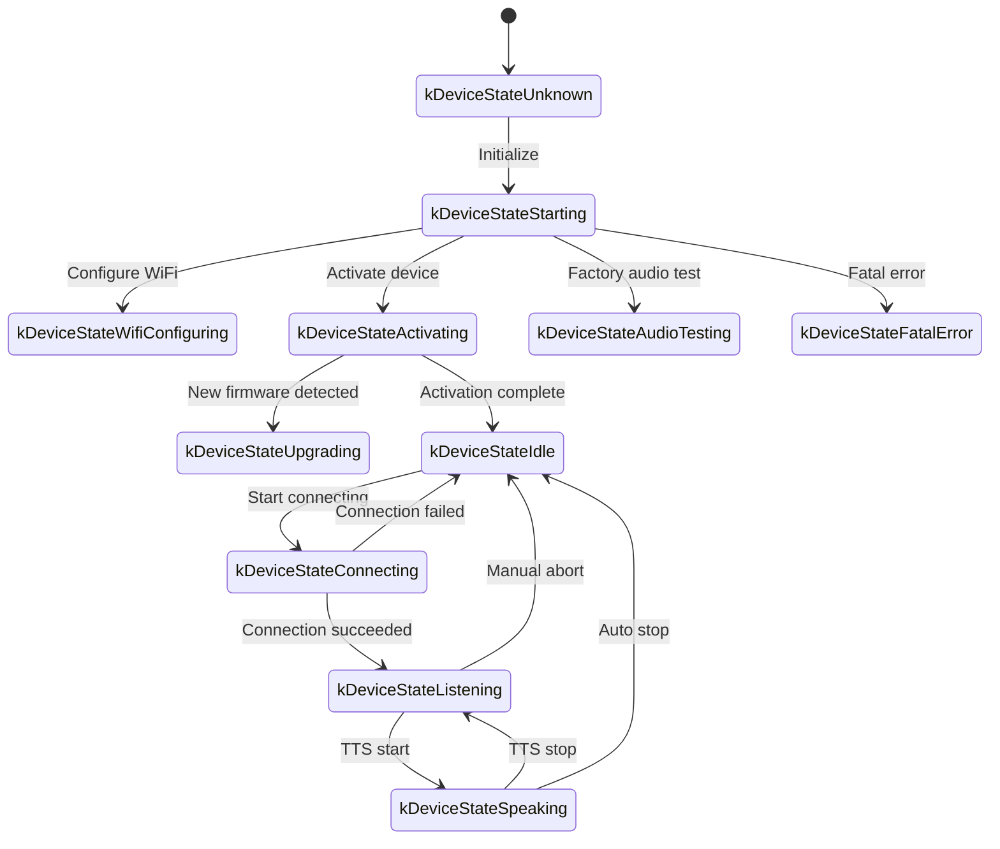
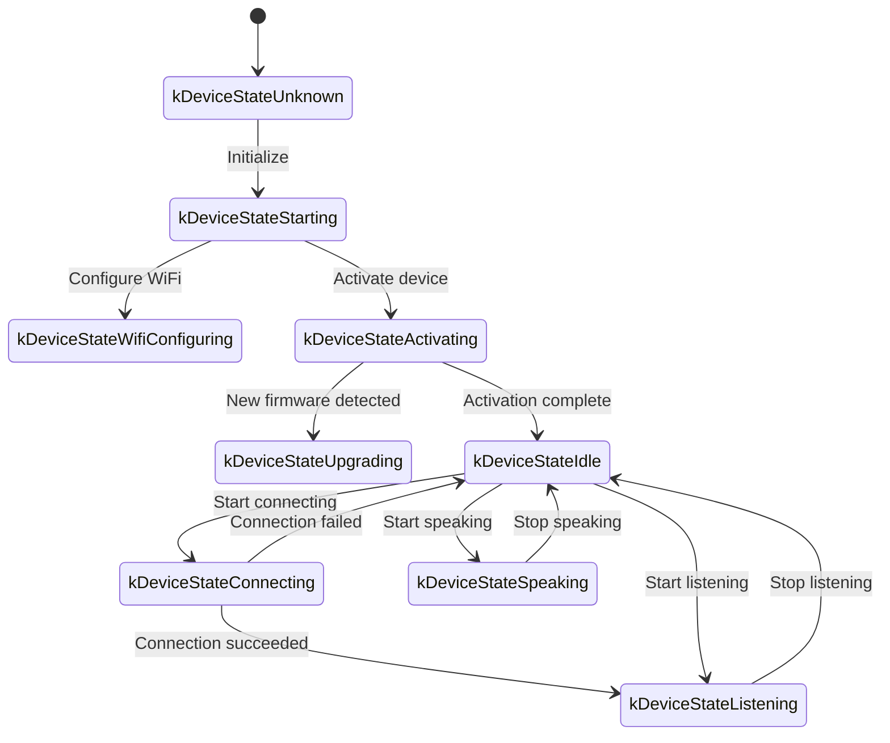

# Протокол связи по WebSocket

В этом документе описан протокол связи по WebSocket между устройством и сервером на основе текущего кода. При реализации сервера сверяйтесь с фактической реализацией.

---

## 1. Общий поток

1. **Инициализация устройства**
   - Устройство загружается и инициализирует `Application`:
     - Инициализирует аудиорежим (кодек), дисплей, светодиоды и т. д.
     - Подключается к сети.
     - Создаёт экземпляр протокола WebSocket (`WebsocketProtocol`), реализующий интерфейс `Protocol`.
   - Входим в главный цикл и ожидаем события (аудиовход, аудиовыход, отложенные задачи и т. д.).

2. **Открытие соединения WebSocket**
   - Когда устройству нужно начать голосовую сессию (активация, нажатие кнопки и т. п.), оно вызывает `OpenAudioChannel()`:
     - Читает URL WebSocket из настроек.
     - Устанавливает заголовки запроса (`Authorization`, `Protocol-Version`, `Device-Id`, `Client-Id`).
     - Вызывает `Connect()` для установления соединения WebSocket.

3. **Устройство отправляет сообщение "hello"**
   - После подключения устройство отправляет JSON-сообщение. Пример:
   ```json
   {
     "type": "hello",
     "version": 1,
     "features": {
       "mcp": true,
       "aec": true,
       "glyph_push": true
     },
     "text_font": {
       "bundle": "noto-v1",
       "charset": "common",
       "size": 20,
       "bpp": 4
     },
     "transport": "websocket",
     "audio_params": {
       "format": "opus",
       "sample_rate": 16000,
       "channels": 1,
       "frame_duration": 60
     }
   }
   ```
   - `features` необязателен и формируется из конфигурации времени компиляции. Например, `"mcp": true` означает, что устройство поддерживает MCP, а `"aec": true` выдаётся при включённом `CONFIG_USE_SERVER_AEC`.
   - `"glyph_push": true` и `text_font` объявляют необязательное расширение динамической передачи текстовых глифов. См. [Расширение динамической передачи глифов текста](glyph-push.md).
   - `frame_duration` соответствует `OPUS_FRAME_DURATION_MS` (обычно 60 мс).

4. **Сервер отвечает "hello"**
   - Устройство ожидает JSON-сообщение, у которого `"type"` равно `"hello"`, а `"transport"` равно `"websocket"`.
   - Сервер может включить `session_id`; устройство его сохранит.
   - Пример:
   ```json
   {
     "type": "hello",
     "transport": "websocket",
     "session_id": "xxx",
     "audio_params": {
       "format": "opus",
       "sample_rate": 24000,
       "channels": 1,
       "frame_duration": 60
     }
   }
   ```
   - Если `transport` совпадает, устройство помечает аудиоканал как открытый.
   - Если корректный hello не получен до истечения таймаута (по умолчанию 10 секунд), соединение считается неудачным и вызывается колбэк сетевой ошибки.

5. **Последующий обмен**
   - В обоих направлениях передаются два вида данных:
     1. **Двоичные аудиоданные** (кодирование Opus)
     2. **Текстовые JSON-сообщения** (состояние чата, события TTS/STT, сообщения MCP и т. д.)

   - В коде колбэк приёма разделяет трафик так:
     - `OnData(...)`:
       - Если `binary` равно `true`, полезная нагрузка трактуется как кадр Opus и декодируется.
       - Если `binary` равно `false`, полезная нагрузка разбирается как JSON и диспетчеризуется по `type`.

   - Когда сервер или сеть рвётся, срабатывает `OnDisconnected()`:
     - Устройство вызывает `on_audio_channel_closed_()` и в итоге возвращается в состояние покоя.

6. **Закрытие соединения WebSocket**
   - Когда устройство хочет завершить сессию, оно вызывает `CloseAudioChannel()`, чтобы разобрать сокет, и возвращается в состояние покоя.
   - Та же цепочка колбэков выполняется, если сокет первым закрывает сервер.

---

## 2. Общие заголовки запроса

При установлении соединения WebSocket устройство устанавливает следующие заголовки:

- `Authorization`: токен доступа, обычно в формате `"Bearer <token>"`.
- `Protocol-Version`: номер версии протокола, соответствующий полю `version` в сообщении hello.
- `Device-Id`: физический MAC-адрес устройства.
- `Client-Id`: программно сгенерированный UUID (сбрасывается при очистке NVS или перепрошивке всей прошивки).

Эти заголовки отправляются при рукопожатии WebSocket; сервер может использовать их для аутентификации или учёта.

---

## 3. Версии двоичного протокола

Устройство поддерживает несколько версий двоичного протокола, выбираемых полем `version` в настройках:

### 3.1 Версия 1 (по умолчанию)
Сырые кадры Opus без дополнительных метаданных. Слой WebSocket уже различает текстовые и двоичные кадры.

### 3.2 Версия 2
Использует структуру `BinaryProtocol2`:
```c
struct BinaryProtocol2 {
    uint16_t version;        // версия протокола
    uint16_t type;           // тип сообщения (0: OPUS, 1: JSON)
    uint32_t reserved;       // зарезервировано
    uint32_t timestamp;      // метка времени в миллисекундах (полезно для серверного AEC)
    uint32_t payload_size;   // размер полезной нагрузки в байтах
    uint8_t payload[];       // полезная нагрузка
} __attribute__((packed));
```

### 3.3 Версия 3
Использует структуру `BinaryProtocol3`:
```c
struct BinaryProtocol3 {
    uint8_t type;            // тип сообщения
    uint8_t reserved;        // зарезервировано
    uint16_t payload_size;   // размер полезной нагрузки
    uint8_t payload[];       // полезная нагрузка
} __attribute__((packed));
```

---

## 4. Структура JSON-сообщений

Текстовые кадры WebSocket несут JSON. Ниже перечислены наиболее частые значения `"type"` и их семантика. Неперечисленные поля могут быть специфичны для реализации или необязательны.

### 4.1 Устройство -> Сервер

1. **Hello**
   - Отправляется после установления соединения; объявляет параметры устройства.
   - Пример:
     ```json
     {
       "type": "hello",
       "version": 1,
       "features": {
         "mcp": true,
         "aec": true
       },
       "transport": "websocket",
       "audio_params": {
         "format": "opus",
         "sample_rate": 16000,
         "channels": 1,
         "frame_duration": 60
       }
     }
     ```

2. **Listen**
   - Сообщает серверу, что устройство начинает или останавливает захват с микрофона.
   - Обычные поля:
     - `"session_id"`: идентификатор сессии.
     - `"type": "listen"`
     - `"state"`: `"start"`, `"stop"` или `"detect"` (обнаружено слово активации).
     - `"mode"`: `"auto"`, `"manual"` или `"realtime"`.
   - Пример (начало прослушивания):
     ```json
     {
       "session_id": "xxx",
       "type": "listen",
       "state": "start",
       "mode": "manual"
     }
     ```

3. **Abort**
   - Прерывает текущее воспроизведение TTS или голосовой канал.
   - Пример:
     ```json
     {
       "session_id": "xxx",
       "type": "abort",
       "reason": "wake_word_detected"
     }
     ```
   - `reason` может быть `"wake_word_detected"` или иным значением, определённым реализацией.

4. **Wake Word Detected (обнаружено слово активации)**
   - Отправляется устройством, когда срабатывает локальный детектор слова активации.
   - Перед этим сообщением может транслироваться аудио Opus со словом активации, чтобы сервер выполнил проверку голосовой подписи (voice-print).
   - Пример:
     ```json
     {
       "session_id": "xxx",
       "type": "listen",
       "state": "detect",
       "text": "Hi XiaoZhi"
     }
     ```

5. **MCP**
   - Рекомендуемый канал управления IoT. Обнаружение возможностей устройства и вызов инструментов идут через сообщения `type: "mcp"`, чей `payload` — JSON-RPC 2.0 (см. [документ протокола MCP](./mcp-protocol.md)).
   - Пример ответа «устройство → сервер»:
     ```json
     {
       "session_id": "xxx",
       "type": "mcp",
       "payload": {
         "jsonrpc": "2.0",
         "id": 1,
         "result": {
           "content": [
             { "type": "text", "text": "true" }
           ],
           "isError": false
         }
       }
     }
     ```

---

### 4.2 Сервер -> Устройство

1. **Hello**
   - Подтверждение рукопожатия.
   - Должны присутствовать `"type": "hello"` и `"transport": "websocket"`.
   - Могут присутствовать `audio_params` — параметры аудио, которые ожидает сервер / согласованный с устройством набор.
   - Может присутствовать `session_id`, который устройство запоминает.
   - После получения устройство выставляет событие «аудиоканал открыт».

2. **STT**
   - `{"session_id": "xxx", "type": "stt", "text": "..."}`
   - Результат распознавания речи пользователя. Обычно показывается на дисплее перед переходом к ответу.

3. **LLM**
   - `{"session_id": "xxx", "type": "llm", "emotion": "happy", "text": "😀"}`
   - Указывает устройству обновить эмоцию / мимику в UI.

4. **TTS**
   - `{"session_id": "xxx", "type": "tts", "state": "start"}`: сервер собирается транслировать аудио TTS. Устройство переходит в состояние произнесения.
   - `{"session_id": "xxx", "type": "tts", "state": "stop"}`: сегмент TTS завершён.
   - `{"session_id": "xxx", "type": "tts", "state": "sentence_start", "text": "..."}`: показать текущее предложение в UI (например, отображение субтитров).

5. **MCP**
   - Сервер отправляет команды, связанные с IoT, или получает результаты вызова инструментов. Структура `payload` следует JSON-RPC 2.0.
   - Пример `tools/call` «сервер → устройство»:
     ```json
     {
       "session_id": "xxx",
       "type": "mcp",
       "payload": {
         "jsonrpc": "2.0",
         "method": "tools/call",
         "params": {
           "name": "self.light.set_rgb",
           "arguments": { "r": 255, "g": 0, "b": 0 }
         },
         "id": 1
       }
     }
     ```

6. **System**
   - Системное управление, часто используется для удалённого обновления / администрирования.
   - Пример:
     ```json
     {
       "session_id": "xxx",
       "type": "system",
       "command": "reboot"
     }
     ```
   - Поддерживаемые команды:
     - `"reboot"`: перезагрузить устройство.

7. **Alert**
   - Указывает устройству показать предупреждение и воспроизвести вибрационный звук. Обрабатывается в `Application::OnIncomingJson`.
   - Пример:
     ```json
     {
       "session_id": "xxx",
       "type": "alert",
       "status": "Warning",
       "message": "Battery low",
       "emotion": "sad"
     }
     ```
   - Поля:
     - `status`: короткий заголовок, отображаемый на экране.
     - `message`: подробное сообщение.
     - `emotion`: эмоция, показываемая во время предупреждения (например, `"sad"`, `"neutral"`).

8. **Custom** (необязательно)
   - Доступно при включённом `CONFIG_RECEIVE_CUSTOM_MESSAGE`.
   - Пример:
     ```json
     {
       "session_id": "xxx",
       "type": "custom",
       "payload": {
         "message": "anything you want"
       }
     }
     ```

9. **Двоичные аудиопакеты**
   - Когда сервер передаёт аудио, закодированное Opus, двоичными кадрами, устройство декодирует и воспроизводит их.
   - Кадры, полученные пока устройство находится в состоянии `listening`, отбрасываются, чтобы избежать конфликтов с потоком с микрофона.

---

## 5. Аудиокодек

1. **Устройство загружает аудио с микрофона**
   - После необязательной обработки AEC / NR / AGC аудио кодируется Opus и отправляется двоичными кадрами.
   - В зависимости от версии протокола кадры могут быть сырым Opus (v1) или обёрнуты в структуры метаданных (v2/v3).

2. **Устройство воспроизводит аудио сервера**
   - Входящие двоичные кадры также трактуются как Opus.
   - Устройство декодирует их и отправляет на аудиовыход.
   - Если частота дискретизации отличается от выходной частоты устройства, после декодирования выполняется ресемплирование.

---

## 6. Состояния устройства

### 6.1 Основные состояния

Машина состояний устройства определена в [`main/device_state.h`](../main/device_state.h) и включает:

- `kDeviceStateUnknown`
- `kDeviceStateStarting`
- `kDeviceStateWifiConfiguring`
- `kDeviceStateIdle`
- `kDeviceStateConnecting`
- `kDeviceStateListening`
- `kDeviceStateSpeaking`
- `kDeviceStateUpgrading`
- `kDeviceStateActivating`
- `kDeviceStateAudioTesting`    (заводское тестирование / отладка аудио)
- `kDeviceStateFatalError`      (невосстановимая ошибка, требующая действий пользователя)

### 6.2 Типичные переходы

1. **Idle -> Connecting**
   - Запускается словом активации или нажатием кнопки. Устройство вызывает `OpenAudioChannel()`, настраивает WebSocket и отправляет `"type":"hello"`.

2. **Connecting -> Listening**
   - После подключения вызывается `SendStartListening(...)` и начинается трансляция с микрофона.

3. **Listening -> Speaking**
   - Сервер отправляет `{"type":"tts","state":"start"}`; устройство перестаёт отправлять аудио с микрофона и воспроизводит входящее TTS.

4. **Speaking -> Idle**
   - Сервер отправляет `{"type":"tts","state":"stop"}`. Если включено автопродолжение, устройство возвращается в Listening; иначе — в Idle.

5. **Listening / Speaking -> Idle** (прерывание)
   - `SendAbortSpeaking(...)` или `CloseAudioChannel()` прерывают сессию и закрывают WebSocket.

### 6.3 Диаграмма состояний в автоматическом режиме



### 6.4 Диаграмма состояний в ручном режиме



---

## 7. Обработка ошибок

1. **Ошибка подключения**
   - Если `Connect(url)` терпит неудачу или hello сервера не получен до таймаута, вызывается `on_network_error_()`, и устройство показывает предупреждение «не удалось подключиться».

2. **Разрыв соединения с сервером**
   - Если WebSocket неожиданно рвётся, вызывается `OnDisconnected()`:
     - Выполняется `on_audio_channel_closed_()`.
     - Устройство возвращается в Idle (или повторяет попытку, в зависимости от политики).

---

## 8. Прочие замечания

1. **Аутентификация**
   - Устройство передаёт `Authorization: Bearer <token>`; сервер должен его проверять.
   - Если токен отсутствует или некорректен, сервер может отклонить рукопожатие или завершить сессию позже.

2. **Область сессии**
   - Многие сообщения содержат `session_id`, полезный, когда сервер обслуживает несколько одновременных взаимодействий.

3. **Аудиополезная нагрузка**
   - Формат аудио по умолчанию — Opus, 16 кГц, моно. Длительность кадра задаётся `OPUS_FRAME_DURATION_MS` (обычно 60 мс). Сервер может использовать 24 кГц на нисходящем канале для лучшего воспроизведения музыки.

4. **Выбор версии двоичного протокола**
   - Настраивается параметром `version`:
     - v1: сырой Opus
     - v2: метаданные + метка времени (полезно для серверного AEC)
     - v3: облегчённый заголовок
   - Значение возвращается в заголовке `Protocol-Version` и в сообщении hello.

5. **Управление IoT через MCP**
   - Всё обнаружение возможностей IoT и управление идёт через MCP (`type: "mcp"`). Устаревший протокол `type: "iot"` выведен из использования (deprecated).
   - MCP работает и по WebSocket, и по MQTT, обеспечивая лучшую стандартизацию и расширяемость.
   - Подробности см. в [документе протокола MCP](./mcp-protocol.md) и в [использовании MCP для управления IoT](./mcp-usage.md).

6. **Некорректный JSON**
   - Когда отсутствует обязательное поле вроде `type`, устройство пишет в журнал `ESP_LOGE(TAG, "Missing message type, data: %s", data);` и игнорирует сообщение.

---

## 9. Пример потока сообщений

Упрощённый двусторонний обмен:

1. **Устройство -> Сервер** (рукопожатие)
   ```json
   {
     "type": "hello",
     "version": 1,
     "features": {
       "mcp": true,
       "aec": true
     },
     "transport": "websocket",
     "audio_params": {
       "format": "opus",
       "sample_rate": 16000,
       "channels": 1,
       "frame_duration": 60
     }
   }
   ```

2. **Сервер -> Устройство** (подтверждение рукопожатия)
   ```json
   {
     "type": "hello",
     "transport": "websocket",
     "session_id": "xxx",
     "audio_params": {
       "format": "opus",
       "sample_rate": 16000
     }
   }
   ```

3. **Устройство -> Сервер** (начало прослушивания)
   ```json
   {
     "session_id": "xxx",
     "type": "listen",
     "state": "start",
     "mode": "auto"
   }
   ```
   Устройство начинает транслировать двоичные кадры Opus.

4. **Сервер -> Устройство** (результат ASR)
   ```json
   {
     "session_id": "xxx",
     "type": "stt",
     "text": "what the user said"
   }
   ```

5. **Сервер -> Устройство** (начало TTS)
   ```json
   {
     "session_id": "xxx",
     "type": "tts",
     "state": "start"
   }
   ```
   Затем сервер передаёт двоичные кадры Opus для воспроизведения устройством.

6. **Сервер -> Устройство** (остановка TTS)
   ```json
   {
     "session_id": "xxx",
     "type": "tts",
     "state": "stop"
   }
   ```
   Устройство останавливает воспроизведение и, если дальнейшие инструкции не поступают, возвращается в состояние покоя.

---

## 10. Итог

Этот протокол передаёт JSON-текст и двоичные кадры Opus по соединению WebSocket, реализуя аудиопотоковую передачу, воспроизведение TTS, распознавание речи, управление состоянием устройства, диспетчеризацию MCP и многое другое. Ключевые черты:

- **Рукопожатие**: отправить `"type":"hello"` и дождаться ответа сервера.
- **Аудиоканал**: двунаправленное вещание Opus с тремя вариантами двоичной упаковки кадров.
- **JSON-сообщения**: диспетчеризация по `"type"` (TTS, STT, MCP, WakeWord, System, Alert, Custom, ...).
- **Расширяемость**: дополнительные поля в JSON, дополнительные заголовки для аутентификации.

Сервер и устройство должны соглашаться относительно смысла, момента отправки и обработки ошибок каждого типа сообщений, чтобы сессия проходила гладко. Приведённый текст служит основой для интеграции, отладки и расширения.
