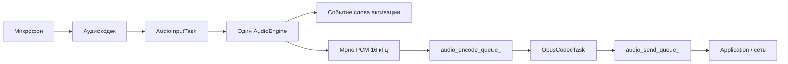

# Архитектура аудиосервиса

`AudioService` владеет одним входным движком и удерживает ввод-вывод кодека, кодирование/декодирование Opus и сетевые очереди независимыми от зависящего от конкретного чипа конвейера обработки речи.

## Входные движки

Прежние комбинации `AudioProcessor + WakeWord` заменены единым интерфейсом `AudioEngine`. `AudioInputTask` однократно читает PCM и передаёт данные ровно одному движку.

| Цель | Движок | Слово активации | Обработка восходящего потока |
| --- | --- | --- | --- |
| ESP32-S3 / ESP32-P4 / ESP32-S31 | `AfeAudioEngine` | WakeNet внутри AFE либо MultiNet, питаемая выходом AFE | FD AEC + VAD при включённой обработке аудио |
| ESP32 / ESP32-C3 / ESP32-C5 / ESP32-C6 | `LiteAudioEngine` | Автономный WakeNet, если настроен | Сырой монофонический PCM |

`AfeAudioEngine` владеет единственным экземпляром FD AFE. WakeNet и голосовой восходящий поток разделяют этот экземпляр, поэтому одновременное включение обоих больше не создаёт два конвейера AFE. Для пользовательских слов активации MultiNet выход выборки (fetch) AFE передаётся в `CustomWakeWord`; на более слабых целевых чипах MultiNet не создаётся.

Конфигурация AFE в настоящее время использует FD AEC в режиме `FD_LOW_COST` с `AEC_NLP_LEVEL_VERYAGGR`. Шумоподавление WebRTC/NSNet намеренно отключено, поскольку проект не поставляет модель NSNet.

Когда включена загрузка аудио слова активации, последние две секунды PCM хранятся в одном 64 КБ кольцевом буфере PSRAM. WakeNet и MultiNet разделяют одну реализацию кэша, а энкодер читает его по одному кадру Opus за раз. Это позволяет избежать прежних выделений внутренней SRAM на каждый фрагмент и временного буфера конкатенации PCM.

## Поток входных данных

Обнаружение слова активации и обработка речи — независимые состояния выполнения одного и того же движка. На целях с AFE AEC остаётся активным, пока активно обнаружение слова активации, чтобы эталон воспроизведения был доступен для активации во время воспроизведения устройством звука. Он также остаётся активным во время обработки речи, когда запрошен AEC на стороне устройства.

## Поток выходных данных

## Задачи и управление электропитанием

- `AudioInputTask` читает вход кодека и передаёт данные выбранному движку.
- `AudioOutputTask` выгружает декодированный PCM на выход кодека.
- `OpusCodecTask` кодирует восходящий PCM и декодирует нисходящие пакеты.
- `AfeAudioEngine` имеет собственную задачу fetch AFE на S3/P4/S31.

Таймер управления питанием аудио по-прежнему включает и отключает каналы АЦП/ЦАП кодека на основе активности; рефакторинг движков эту политику не меняет.
